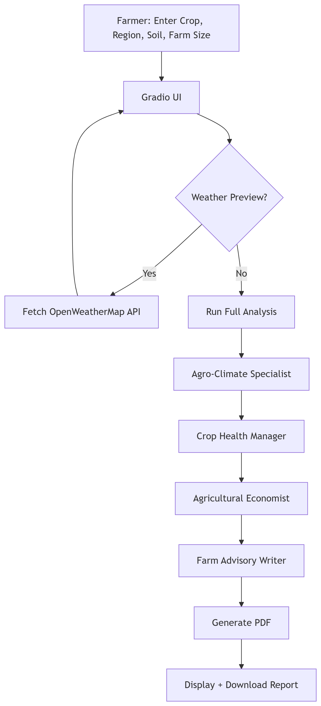

# 🌱 AI-Powered Farming Advisor System

Uses CrewAI multi-agent LLMs for crop-specific analysis:
- Soil & climate assessment
- Pest & disease recommendations
- Cost-benefit evaluation
- Final PDF report

## ✨ Features

- Multi-agent system using CrewAI
- Real-time weather integration via OpenWeatherMap
- Custom recommendations for crop health and farm economics
- Auto-generated farmer-friendly report in PDF format
- Clean, interactive Gradio interface

## 🧠 System Workflow

## 📝 Inputs

- Crop type (e.g., Maize)
- Region (e.g., Axum)
- Soil data (e.g., pH: 6.2, Nitrogen: medium)
- Farm size (e.g., 400 acres)

## 📤 Output

- Detailed advisory report in plain text
- Downloadable PDF version

## 🧰 Technologies Used

- Python
- Gradio (Web UI)
- FPDF (PDF generation)
- OpenWeatherMap API
- CrewAI (LLM agent framework)
- Groq API (LLM backend)

## 📄 Sample Output
[📥 Download PDF Report](examples/wheat-USA-report.pdf)

## 🚀 How to Run
1. Add `.env` with your API keys
2. Install requirements: `pip install -r requirements.txt`
3. Run: `python farming_advisor_agent_code_best.py`
